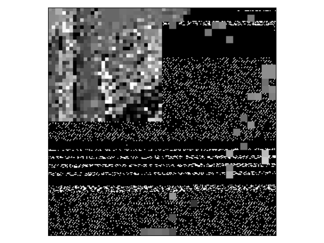
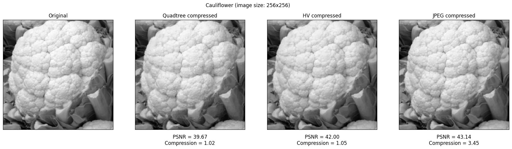
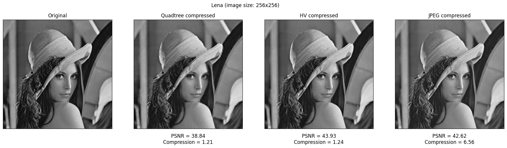
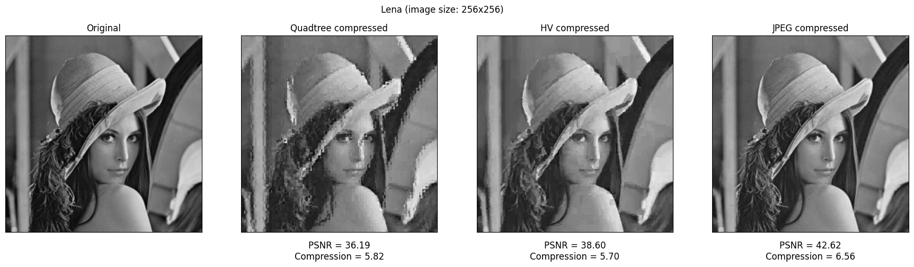
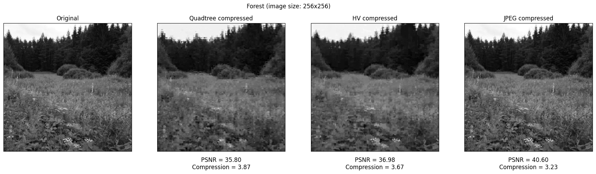
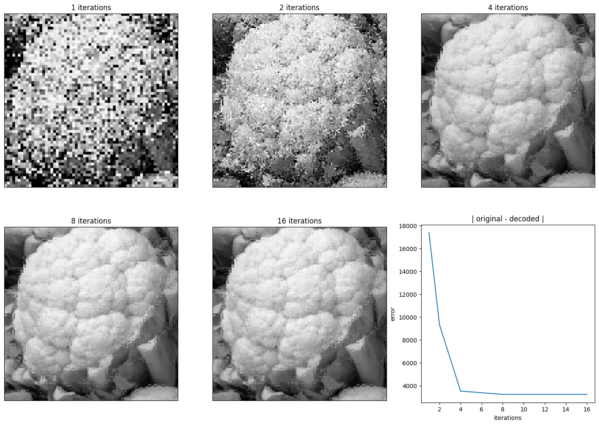
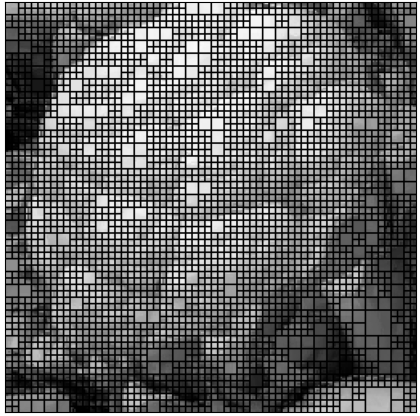
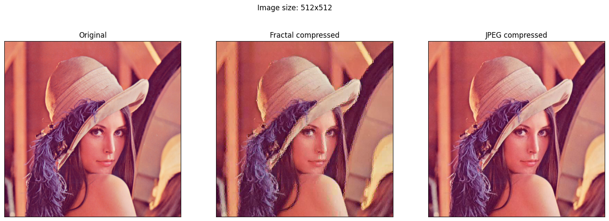
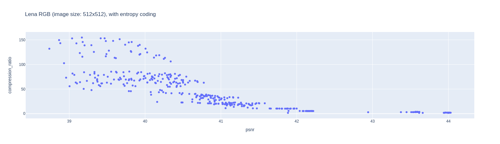
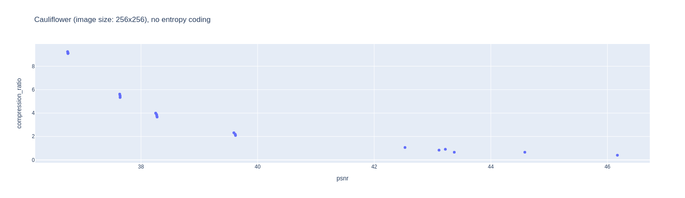

# Fractal Image Compression

Requirements:
- python>=3.10

Installation:
- `pip install -r requirements.txt`


# 1. Theoretical background

Fractal image compression is a class of methods that allows to store images using less memory by utilizing the properties of fractals. In this section, we outline the theory necessary for understanding this approach, and then we present how that theory can be applied to lossy image compression. For more details see [1].

## 1.1 Fractals and copy machine

Fractals are geometric shapes that have detailed structure at arbitrary scales, meaning that we can "zoom in" infinitely and still see the details of a non-trivial shape. Many fractals are self-similar, meaning that a zoom of a fractal looks similar to the not-zoomed fractal. A well-known example of a self-similar fractal is a <a href="https://en.wikipedia.org/wiki/Mandelbrot_set">Mandelbrot set</a>, depicted in the figure below.

<p align="center">
  
</p>

One way of constructing fractals is to use the abstraction of a copy machine. Imagine a machine that as an input, takes an arbitrary image and, as an output, produces an image made of multiple shrinked copies of that image. The figure below illustrates this idea when the original image is shrunk twice in both dimensions and then copied three times to different positions. For this discussion, assume that we can represent images with arbitrary precision, i.e., the image has infinite resolution.

<p align="center">
  
   <em>source: Fractal Image Compression: Theory and Application, Y. Fisher</em>
</p>

We can use this machine multiple times on the image that it outputted previously. Figure below illustrates what happens when we apply the machine multiple times to different initial images.

<p align="center">
  
  <em>source: Fractal Image Compression: Theory and Application, Y. Fisher</em>
</p>

We can notice two things:
1. no matter what the initial image was, the resulting structure after multiple iterations becomes similar,
2. there exists an image for which the application of the copy machine produces an image that looks exactly the same.

The second property means that we indeed obtained a fractal (called the <a href="https://en.wikipedia.org/wiki/Sierpi%C5%84ski_triangle">Sierpiński triangle</a>), since now we can work backward and zoom into one of those three copies and realize that it is exactly the same as the whole image. 

The first property tells us that there exists an image specific to this machine to which every initial image eventually converges. We can see that this is true because every application of the copy machine makes the initial image 4 times smaller (in area), so the area eventually converges to 0, meaning that the initial shape becomes a point. This resulting image is called an attractor and it is defined only by the operations performed by the copy machine, so if different operations were perfomed (e.g., copies were positioned differently), the attractor would be different.


## 1.2 Iterated function systems

A single copy operation that scales and translates (and possibly skews, stretches, rotates) the initial image can be expressed as an affine transformation $w_i$:

$$
w_i \begin{bmatrix} x \\\ y \end{bmatrix} = \begin{bmatrix} a_i & b_i \\\ c_i & d_i \end{bmatrix} \begin{bmatrix} x \\\ y \end{bmatrix} + \begin{bmatrix} e_i \\\ f_i \end{bmatrix}
$$

Single operation performed by the copy machine can then be expressed as an iterated function system (IFS) $W$, which consists of a collection of transformations $\set{ w_i : \mathbb{R}^2 \to \mathbb{R}^2 | i = 1, ..., n}$, defined as:

$$
W\begin{bmatrix} x \\\ y \end{bmatrix} = \bigcup_{i=1}^n w_i\begin{bmatrix} x \\\ y \end{bmatrix} 
$$

The limitation of those affine transforms is that they must be contractive, meaning that they must reduce the size of the input when making the copy. It can be shown that if every $w_i$ is contractive, then the IFS $W$ is also contractive. Such an IFS $W$ is called a contractive map and it fully defines the copy machine.

Intuitively, the limitation of using only contractive transformations is due to the fact that if the transformations were able to enlarge the copy, the attractor would have to be infinite since we would gain larger and larger copies.

Formally, this limitation is founded by the <a href="https://en.wikipedia.org/wiki/Banach_fixed-point_theorem">Banach fixed-point theorem</a>, which states that given a contractive mapping $W$ on a set of images, there exists a special image, called the attractor $x_w$, with the following properties:
- Application of $W$ to the attractor yields the attractor itself, that is, $W(x_w) = x_w$. Attractor $x_w$ is called the fixed point of $W$.
- Let $S_0$ be the initial image and let $S_k = W^k(S_0)$ denote the k'th application of map $W$ on the output it previously produced, starting with $S_0$, so $S_k = W(W(...^{k-3\ times}(W(S_0))))$. Then the attractor, which is a result of running the copying machine in a feedback loop, is the limit set: 
    $$x_w = S_{\infty} = \lim_{n\to \infty} W^n(S_0)$$
    that doesn't depend on the choice of the initial image $S_0$.
- $x_w$ is unique.

What this means is that we can choose a set of contractive maps $W$, take any initial image, apply it in a feedback loop and obtain a unique image that is the attractor for the chosen $W$. 


## 1.3 Real images


Natural images are not fractals, they are not built from reduced copies of themselves. But they often contain other type of self-similarity where some parts of image appear in reduced form in other places of the image. For example, consider the image below, stems of sunflowers, seed heads and corolla appear in multiple places and sizes in the image. This applies especially to smaller blocks in these objects (e.g. just a part of a stem that appers in other stem). Same idea applies to uniform regions such as the sky. Fractal compression scheme attempts to eliminate this type of redundancy in images in order to save the memory required to store the image. Copies of regions within the image are not perfect, however, hence the compression will form an approximation and will be lossy.


The copy machine defined above operated on entire images and it was limited to binary images, in order to work with real images it must be extended with:
- a contrast and brightness adjustment for each copy,
- a mask that selects, for each copy, a part of the original image to be copied.

So, now the mathematical definition of a single copy operation that applies to some part of an image can be written as:

$$
w_i \begin{bmatrix} x \\\ y \\\ z \end{bmatrix} = \begin{bmatrix} a_i & b_i & 0 \\\ c_i & d_i & 0 \\\ 0 & 0 & s_i \end{bmatrix} \begin{bmatrix} x \\\ y \\\ z \end{bmatrix} + \begin{bmatrix} e_i \\\ f_i \\\ o_i \end{bmatrix}
$$

Where third dimention denotes brightness of an image (we limit ourselves to grayscale images, color channels can be handled in the same way) and thus $s_i$ denotes the contrast adjustment and $o_i$ denotes the brightness adjustment.

And to handle this masking, where different transforms are applied to different parts of the original image we use a mathematical model of a partitioned iterated function system (PIFS). We denote a portion of the image that is passed to this new copy machine as $D_i$ (i'th Domain), and a portion of the new image that the machine produces from this domain as $R_i$ (i'th Range). Transformation is applied to whole $D_i$ by the map $w_i$. With this notation PIFS can be described in almost the exact same way as IFS:

$$
W\begin{bmatrix} x \\\ y \\\ z\end{bmatrix} = \bigcup_{i=1}^n w_i\begin{bmatrix} x \\\ y \\\ z \end{bmatrix} 
$$

In order to have the machine produce an image of the same dimensions we need to cover the entire 2d image, that is, for each image pixel there must exist exactly one range $R_i$ that covers it. Machine can be run in a feedback loop just as before, similarly for PIFS, the attractor can be defined as an image $f$ such that $W(f) = f$.

Again, for the Fixed-point Theorem to apply we need to have W contractive, although it is not a necessary condition to achieve this, we will have both:
- domains larger than ranges (so that the "copy" of a part of the image is smaller than the original),
- contrast of a "copy" must be smaller than the contrast of the original, that is $s_i < 1$.

The theorem guarantees that applying $W$ to any initial image $f$ in a feedback loop would produce the attractor.


## 1.4 Image encoding


The discussion above presented how to go from PIFS (described with a map $W$) to an image (i.e. how to decode the compressed image), but in terms of image compression, the image is an input, so here we will need to work somewhat backward. 

As an input we will receive the image that we want to compress and our job will be to construct a contractive map $W$ for what that image is the attractor. If we find such a map, then we can take any initial image (e.g. fully black image), apply the map $W$ multiple times (in practice the infinite number of applications is not necessary) and reconstruct the image that we compressed. And so we would only need to store the map $W$ on the disk.

More formally, given an image $f$, we need to find a contractive map $W$ such that:

$$f \approx f_w = W(f_w) \approx W(f) = w_1(f) \cup w_2(f) \cup ... \cup w_n(f) $$

Where $f_w$ is the attractor of $W$ that we need to construct. Attractor ideally should be equal to the initial image $f$, the approximation is due to the fact that we usually won't be able to find regions that can be precisely mapped to other regions, as real images are not perfectly self-similar.

Let $F(R_i)$ denote the brightness values of original image region over $R_i$. The problem can thus be stated as:

$$ \begin{equation} minimize \ d(F(R_i), w_i(f)) \ for \ i = 1,..., n \end{equation}$$

Where $d$ is a metric used to compute the difference between part of the original image and the part obtained by mapping other part of the image with $w_i$, we can use for example a RMS metric.

Furthermore, since our job is to compress an image, we can't use too many transforms $w_i$, as they are what ultimately gets written to the disk. So we need to find a balance between fidelity (i.e. the precision to which we minimize (1)) and compression rate.

What we described here is more of a meta-algorithm, multiple approaches of solving this problem exist, they focus particularly on the way in what the image is partitioned into regions. In the following sections we provide a detailed description of two algorithms: Quadtree and HV, we also provide their implementation and evaluation.

## 1.5 Bruteforce algorithm

A a baseline for comparing the algorithms in our project we implemented a bruteforce algorithm for this problem. Its operation is very simple - it has a fixed range size and domain size, and for each range it loops through avaliable domains and its transformations, evaluates them based on the calculated RMS error, and chooses the top one. The main drawback of this method is that it is inflexible and relatively time-consuming.

The pseudocode for this algorithm can be described as follows:
```
1. Encode(image):
2.     ranges = divide image into subimages of fixed size (m, m)
3.     result_domains = []
4.     for range in ranges:
5.         best_domain = Find_best_domain(range)
6.         add best_domain to result_domains
7.     return result_domains

8. Find_best_domain(range):
9.     possible_domains = divide image into subimages of fixed size (2m, 2m)
10.    add transposition of each domain into possible_domains
11.    add all four 90 degree rotations of each domain into possible_domains
12.    best_domain_info = None
13.
14.    for domain in possible_domains:
15.        subsampled_domain = subsample 2x2 pixel groups of domain
16.        RMS = calculate RMS error between subsampled_domain and range
17.        if RMS < best_RMS:
18.            best_RMS = RMS
19.            best_domain_info = domain identifier, rotation and transposition info
20.     return best_domain_info
```


# 2. Quadtree algorithm

Quadtree algorithm uses a partitioning scheme that builds a tree where each non-leaf node has 4 children, hence the name quadtree. The implementation is available in <a href="./src/quadtree">./src/quadtree</a> directory, it depends only on numpy and numba libraries.

## 2.1 Algorithm

As stated in section 1, we need to partition an image into many small images, such that for each of them we can find a bigger subimage that minimizes equation (1). The subimages, hovewer, don't need to have equal sizes, so if we manage to find a relatively big subimage (e.g., 64x64 pixels) that can be well covered by some other bigger subimage then we will achieve better compression. Otherwise we should split it into more smaller images, as its generally simpler to find self-similarities at higher granualities. To decide whether we should split further we check if the optimial value for equation (1) is lower than some constant factor $\epsilon$.

The metric that we use is a RMS metric. To compute it between images of different size, we first must define a way to match their sizes. 

Let $f(i, j)$ denote the brightness of pixel at index $(i, j)$, let $(i_R, j_R)$ denote index of top left pixel in a subimage, let $(w, h)$ denote its width and height. Assume that we've found another subimage twice as big in both dimensions, let $(i_D, j_D)$ denote its top left index. In order to match sizes of these two subimages we subsample the second one, i.e. we convert each non overlapping $2x2$ square into a single pixel by averaging brightness values in that square, note that this operation decreases width and height of that subimage by half, matching the size of the smaller image. 

Let $f_s(i, j)$ be the brightness of pixel at index $(i, j)$ in a subimage subsampled in that manner. Then we can define the RMS metric between subimages $R$ and $D$ as follows:

$$d_{rms}(R, D) = \sqrt{\frac{1}{wh}\sum_{0\le k \lt w} \sum_{0\le m \lt h} (f(i_R + k, j_R + m) - (s*f_s(i_D + k, j_D + m) + o))^2}$$

Where $s$ is the contrast scaling factor, and $o$ is the brightness adjustment, as defined in section 1.2. To find $s$ and $o$ factors that minimize $d_{rms}$ for chosen subimages $R$ and $D$, we solve:

$$\begin{cases} \frac{\partial d_{rms}}{\partial s} = 0 \\\ \frac{\partial d_{rms}}{\partial o} = 0 \\\ |s| < 1 \end{cases}$$

Note that:
- by selecing $(i_D, j_D)$ that maps to chosen $(i_R, j_R)$ we specify the translation factor of map $w_i$ defined in section 1.3, since it effectively moves one part of the image into another inside the copy,
- by subsampling the subimage $D$ we ensure spatial contractivity (the copy is smaller),
- by selecting $s$ and $o$ we specify the brightness adjustments and by forcing $|s| < 1$ we ensure brightness contractivity.

What remains to define the affine transform $w_i$ for a discrete image is allowing rotations. There is 8 ways to rotate the image: four $90\degree$ rotations for transposed and non-transposed subimage.

Minimizing this metric for subimage of size $(w, h)$ would require checking all possible subimages of size $(2w, 2h)$ and computing $s$ and $o$ that minimizes $d_{rms}$ for all 8 orienations.

We now need to specify the way to partition the original image into regions. Assume that the full image is a square with sides of size $2^n$, if that's not the case, the image can always be divided into multiple such squares width different sides. In order to partition the full image into multiple smaller images quadtree splits it recursively into 4 images with sides of size $2^{n-1}$ in a manner depicted in the figure below:

<p align="center">
  
  <br/>
  <em>source: Fractal Image Compression: Theory and Application, Y. Fisher</em>
</p>


The pseudocode for the encoding algorithm is as follows, assume that ϵ, min_splits, max_splits are known hyperparameters, f is the image and depth is an integer value starting at 0:

```
1. Quadtree(f, depth) -> QuadtreeNode:
2.    q = new QuadtreeNode()
3.    if depth < min_splits:
4.        Partition(f, depth, q)
5.    else:
6.        D = domain twice as big as f that minimizes RMS metric for image f
7.        r = the optimal RMS value for chosen D
8.        s, o = optimal parameters for that RMS value
9.        if r > ϵ and depth < max_splits:
10.           Partition(f, depth, q)
11.       else:
12.           mark q as a leaf node
13.           assign top-left index of D, s, o and D's orientation to the node q
14.    return q
15.
16.
17. Partition(f, depth, parent):
18.    mark parent as an inner node
19.    subimages = divide f into 4 subimages
20.    for (i, sub_f) in enumerated subimages:
21.        child_node = Quadtree(sub_f, depth + 1)
22.        assign child_node as i'th child of parent
```

The hard part is finding the optimal domain D (line 6.), we elaborate on this issue in the following section.

The decoding is straightforward, it simply applies the copy machine in a feedback loop. The contractive affine transformations are encoded in quadtree nodes:
```
1. DecodeQuadtree(root) -> image:
2.     f = new image with arbitrary pixel values
3.     while not converged to attractor:
4.         fc = copy of image f
5.         leaves = traverse quadtree into leaves
6.         for leaf in leaves:
7.             R = part of image f that current leaf represent
8.             domain = part of image fc that maps to R
9.             D = reorient and subsample domain
10.            R = leaf.s * D + leaf.o
11.            store R in the same position of f it was taken from
12.    return f
```

We can check if the image converged to the attractor by comparing its values with the values it had in the previous iteration, if the difference is negligible, we can stop. In practice, usually about 10 iterations suffice.

## 2.2 Complexity analysis

Let $(w, h)$ be the width and height of an image, let $N = wh$ and let $d$ be the number of tree depths at which we consider finding optimal domains, finally let $m_d$ denote size of an subimage at depth $d$. In the worst case there are $\sum_d\frac{N}{m_d} = O(dN)$ subimages and for each one of them we need to find an optimal domain.

Let $m_d$ denote the size of a subimage at depth $d$, we need to find a domain of size $4m_d$. Assume that we consider only non overlapping domains, in such case at each tree depth there is $O(\frac{N}{m_d})$ of them. Computing the RMS metric for such two images require $O(m_d)$ operations.

Thus, in this basic scenario, the overall complexity of encoding a single image would be:

$$O(dN*\frac{N}{m_d} * m_d) = O(dN^2)$$

which is completely unfeasible for larger images, especially if we account for a pretty big constant in that estimation.

We can control $d$ and set it at a reasonable level (e.g., we search only for subimages of size 32x32, 16x16,...,4x4). Furthermore, we can cache computations related to computing RMS metric for all domains (since they are shared for all subimages), thus (assuming that now $d$ is a constant) we would go down to $O(\frac{N^2}{m})$, where $m$ is the average size of a subimage.

There is not much more that we can do in terms of asymptotic complexity, but we can significantly speed up the process of finding the optimal domain by reducing our search to only the most promising domains.

We do this by building a domain pool for every possible size (e.g. 32x32, ..., 4x4). Then we divide domains of each of these sizes into 72 classes. We first assign 1 of 3 major classes based on ordering of means of brigtness values of their 4 subimages. It is always possible to orient the domain in a way that means of brightness values are ordered like in the figure below:

<p align="center">
  
</p>

Then, for each of these 3 major classes we assign 1 of 24 minor classes based on the ordering of variance of brightness values (there is $4! = 24$ ways to order 4 variance values).

Once we do this, during encoding we can search only domains from the class of the currently processed subimage.

We should also note that this algorithm is trivially parallelizable, so the theoretical complexity doesn't need to be that daunting. We provide only the sequential implementation.

The complexity of decoding is $O(N)$ with usually a small numer of iterations (~10).

## 2.3 Encoding and postprocessing

By default, we quantize contrast and brightness adjustments using 5 and 7 bits respectively. Target subimage (its position and size) of every affine transformation is implicitly encoded by the way in which the tree is constructed, thus for each such subimage we must encode only the domain position. Inner node is encoded with a $0$ bit and is followed by the encoding of its children. Leaf node is prefixed with a $1$ bit, then we encode quantized contrast adjustment, brightness adjustment, row and column of top left pixel of a domain, orientation and rotation of a domain. We store orientation and rotation using 3 bits as there are 8 possible cases.

For the first four dimensions of leaf values we construct a separete Huffman tree and we entropy-encode them before saving to disk. We save Huffman coding table in the file's header.

After decoding the image we perform a simple filtering operation to reduce blocking artifacts caused by independace of encoded subimages. For each boundary of a subimage we compute a weighted average of brightness values across that boundary.

## 2.4 Decoding showcase

Animations below show decoding process for cauliflower and lena images. Decoding starts with a random noise and iteratively reconstructs original image. Single animation frame consists of 100 and 250 decoded domains respectively. Animations show 5 decoding iterations, further iterations may result in slightly better results, postprocessing is not applied.

Cauliflower 128x128             |  Lena 256x256
:-------------------------:|:-------------------------:
  |  

# 3. HV algorithm

The HV Encoding Scheme is unique in its approach to partition the image. At its core, it repeats two basic functions: recursive partitioning and domain search. The goal of partitioning is to fincd non-overlapping ranges of the image, whereas domain search determines the mapping of a domain onto each range. This scheme requires for the domains to always be larger than the ranges by at least a factor of 2 (which was the approach chosen for this project). 
As an example, during the first iteration of the process, the entire image is considered as the potential range. First, the size of the range is compared against the domain size. In this case it will not be small enough, so a domain cannot be mapped onto this range. Using partitioning, two new potential ranges are selected from the original one,and the process is repeated. Should a potential range be sufficiently small, it is compared with domains during the domain search phase. Such potential ranges will be subdivided further if no domain yields a computed difference smaller than a predefined threshold.

## 3.1 Algorithm

### 3.1.1 Encoding

During the partitioning phase, each row and column of the potential range has an average value calculated: $avg_h = \sum_{i} r_{i,j}$ and $avg_v = \sum_{j} r_{i,j}$. On that basis the biased differences are computed (horizontal and vertical):

$$h_j = \frac{min(j, M - j - 1)}{M - 1}(\sum_ir_{i, j} - \sum_ir_{i,j+1})$$

$$v_i = \frac{min(i, N - i - 1)}{N - 1}(\sum_jr_{i, j} - \sum_jr_{i+1,j})$$

The optimal split is the one with the highest biased difference, whether horizontal or vertical.

The pseudocode for the partitioning function can be described as follows:
```
Partition(Range) -> (Range, Range):
    v = array holding vertical biased differences
    h = array holding horizontal biased differences
    v_max, h_max = indices of maximal values of v and h
    if h[h_max] > v[v_max]:
        P1, P2 = new ranges split horizontally by index h_max
    else:
        P1, P2 = new ranges split vertically by index v_max
    return P1, P2
```

The domain search is very similar to the domain search in the quadtree method. The domains are searched for ranges starting from the largest to the smallest. The domains themselves are created according to a predefined domain size _d, and their centers are positioned on an equidistant lattice, _{d/2} pixels apart. As mentioned above, the chosen domain must be at least 2 times bigger than the range in both axes. The pixels of the domain are either subsampled or averaged in groups of 2x2. The square difference of the pixel values is compared against the predefined threshold. If it is smaller, the transformed domain is accepted. Otherwise, if no domain meets that requirement, the range is divided again (unless the range becomes smaller than the minimal size).

```
DomainSearch(Range) -> Domain:
    if Range.size > domainSize/2:
        no domain found
    else:
        X = array of squared differences of subsampled(D) and Range for each possible domain D
        D = domain that has the smallest value of x in X
        x = squared difference value for D
        if x < threshold:
            return D
        else:
            no domain found
```

The abovementioned functions can be brought together to create the whole algorithm, the pseoudocode of which is as follows:

```
HVCoverImage(Image) -> list[Domain]:
    Queue = queue that will store ranges from largest to smallest
    domains = []
    Queue.append(Image)  # the image is the first range
    while Queue not empty:
        range = Queue.pop()
        domain = DomainSearch(range)
        if domain exists:
            domains.append(domain)
        else:
            P1, P2 = Partition(range)
            if min_size(P1) < min_size(P2):
                P1, P2 = P2, P1
            Queue.append(P1)
            Queue.append(P2)
    return domains
```

### 3.1.2 Storage

The transformations are not stored directly, but instead defined by partitions. Each partition is defined by the following elements:
* partition type (horizontal or vertical)
* position (offset from the upper or left side)
The partitions must be stored from top left to bottom right. 
Alongside, the scaling and offset values are saved for each range. The domain is specified by an index to a list of all possible domains and the rotation type.

### 3.1.3 Decoding

The decoding algorithm is optimized by using a precomputed pointer array, that maps a domain pixel for each range pixel in the image. This is more time-efficient than scanning through the domain-range transformations. The subsampling or averaging of the domain pixels is an obstacle in this approach, which is solved by mapping the average of the four pixels to one range pixel. The scaling and offset information is stored only once per range, in a separate array. Having such structures, the decoding proceeds by taking each range pixel and apply the scale and offset to the averaged/subsampled pixels, and mapping the result onto the image. To obtain a better reconstruction, the decoding process should have multiple iterations.


# 4. Evaluation

Full evaluation scripts and more results can be found in the notebook: <a href="./src/testing.ipynb">./src/testing.ipynb</a>.

## 4.1 Encoding comparison

We evaluate Quadtree and HV algorithms and we compare them with modern JPEG implementation based on a wavelet transform (from Pillow library). We perform comparison on three different images with differerent self-similarity magnitudes.

### 4.1.1 High fidelity parameters

By high fidelity, we mean the parameters that result in decreasing resulting image size (compression > 1) and obtaining the best possible PSNR. Compression ratios of 1 are obviously impractical, but we want to have a view of what is the best quality we can get using these algorithms. Note that cauliflower exhibits high self-similarity, but at very small scales that require using very small range sizes, which results in low compression. Lena, on the other hand, contains many uniform regions that can be covered with bigger ranges.





### 4.1.2 High compression parameters

By high compresion, we mean the parameters that result in recognizable images with significantly decreased sizes. Note that much higher compressions are possible (which we demonstrate in subsequent sections), but here we picked some reasonable PSNR/compresion ratios. We selected the parameters such that compression ratios of Quadtree and HV are similar, and we compare their encoding qualities.





We can notice that HV has much better PSNR than Quadree for the same compression ratios.


## 4.2 Quadtree

We now provide more detailed evaluation of the quadtree algorithm. The plot below illustrates how the quality of the image changes with decoding iterations, we can notice that after about 8 iterations image converges to the attractor.



The image below illustrates an example of how quadtree divedes an image into subimages, we can see that more uniform regions were covered by bigger ranges.

<p align="center">
  
</p>

Plots below show compression ratios by psnr for different encoding parameters, we can change the following parameters:
- minimum range size (to how small subimages can quadtree divide original image)
- maximum range size (for how big subimage can quadtree start searching domains)
- number of bits for quantization of scaling and offset factors
- error tolerance (if RMS error is smaller than this value we don't divide images further)
- whether we apply Huffman entropy encoding or not


We can notice a few clouds of points, the main parameter that groups them is the minimum range size, the lower it is, the smaller subimages we can use, which results in higher quality and lower compression. We can also see that Huffman coding improves the compression ratio significantly. Interactive results that label each point with its parameters can be viewed in the notebook. 

 


We have also implemented Quadtree compression for RGB images. First we convert to YCbCr color space, then we encode each dimension with separate Quadtree, we also use 4:2:2 chroma subsampling. The results for Lena 512x512 for high fidelity (42 psnr, 10 compression ratio) and high compression (40 psnr, 80 compression ratio) are shown below.




The plot below shows compression ratio by psnr for different parameters for colored Lena 512x512 image. JPEG gave 46 psnr and 20 compression ratio. Very high compression ratios (~150) are achievable, but for reasonable results (>41 psnr) the compression ratio is about 10.



## 4.3 HV

Plot below show compression ratios by psnr for different encoding parameters, again, the most important parameter is minimum range size, another important one is error tolerance. In contrast to Quadtree this algorithm can reach high encoding qualities due to its increased flexibility. Hovever, it still can't beat JPEG even for highly self-similar images.




# 5. Summary

We implemented two fractal compression algorithms from scratch. Results, in terms of encoding quality, compression ratio and encoding time, are far worse than those of modern JPEG implementations. Nevertheless, in our opinion the fractal compression scheme is more interesting than JPEG. We initially found it surprising that iterative application of the same contractive affine transformations on any image can always produce the same high quality, compressed image.

# References

[1] Fractal Image Compression: Theory and Application, Y. Fisher.

[2] https://en.wikipedia.org/wiki/Fractal
